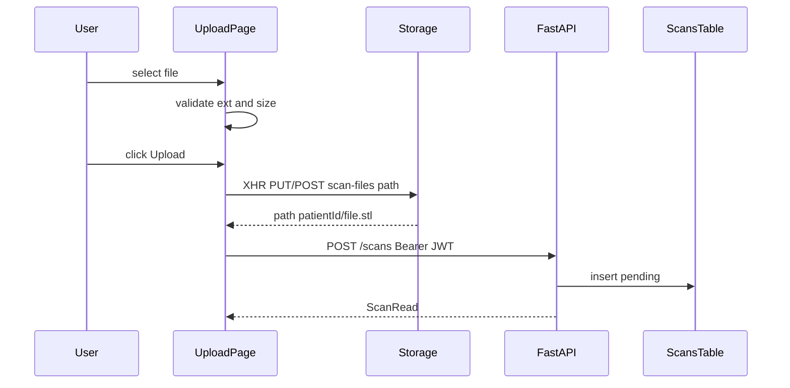

# Upload Scan Page

## Подход (фиксированный)

- Страница: [`frontend/app/upload/page.tsx`](frontend/app/upload/page.tsx) (client component), стиль как у login/dashboard.
- `patient_id` — UUID-поле на форме (отдельного patient picker пока нет).
- Путь в Storage: `{patient_id}/{filename}` (пример: `…/file.stl`).
- Файл → Storage с клиента через authenticated Supabase session.
- Метаданные → `POST /scans` на FastAPI с `Authorization: Bearer <access_token>`; бэкенд записывает `uploaded_by` из JWT.
- Лимит размера: **100 MB** (`100 * 1024 * 1024`).
- Прогресс `%`: кастомный XHR к Storage REST API (у `supabase.storage.upload` нет надёжного `onUploadProgress` в текущем клиенте); Retry вызывает ту же функцию с `File` из state.



---

## 1. Supabase Storage bucket

Новая миграция [`supabase/migrations/YYYYMMDDHHMMSS_scan_files_bucket.sql`](supabase/migrations/):

- Bucket `scan-files`, private, `file_size_limit = 104857600`.
- Policy: authenticated users могут `INSERT` / `SELECT` объекты в этом bucket (минимум для upload + чтения пути).

Без bucket upload упадёт с ошибкой — миграцию нужно применить в проекте Supabase.

---

## 2. Backend: `uploaded_by` + auth на `POST /scans`

В [`backend/app/routers/scans.py`](backend/app/routers/scans.py):

```python
def create_scan(
    payload: ScanCreate,
    user: CurrentUser = Depends(get_current_user),
) -> ScanRead:
    data = {
        "patient_id": str(payload.patient_id),
        "uploaded_by": str(user.id),
        ...
    }
```

Убрать заглушку `uploaded_by: None`.

---

## 3. Frontend env

В [`frontend/.env.example`](frontend/.env.example) и локальный `.env.local` добавить:

```env
NEXT_PUBLIC_API_URL=http://localhost:8000
```

---

## 4. Страница [`frontend/app/upload/page.tsx`](frontend/app/upload/page.tsx)

### Auth

Как на dashboard: при mount `getSession()`; нет сессии → `/login`.

### Форма

- Patient ID (text/uuid, required)
- Scan source: select `patient_direct` | `cast_negative`
- `<input type="file" accept=".stl,.obj,.ply" />`
- Кнопка Upload / Retry

### State

```ts
type Status = "idle" | "uploading" | "success" | "error";
file: File | null          // сохраняем для Retry
status, progress (0–100), errorMessage, uploadedPath?
```

### Валидация при выборе файла

1. Расширение не в `{stl,obj,ply}` (в т.ч. pdf) → `Unsupported file`, status `error`, File не принимать (или сбросить).
2. `file.size > 100 * 1024 * 1024` → `File too large`.
3. Иначе сохранить `File` в state, status `idle`, очистить ошибку.

### Upload (кнопка)

1. status → `uploading`, progress `0`, кнопка disabled.
2. Путь: `${patientId}/${file.name}`.
3. XHR upload на `${NEXT_PUBLIC_SUPABASE_URL}/storage/v1/object/scan-files/${path}`:
   - headers: `Authorization: Bearer ${session.access_token}`, `apikey: ANON_KEY`, `x-upsert: false`
   - `xhr.upload.onprogress` → `progress = round(loaded/total*100)`
   - UI: `Uploading... {progress}%`
4. Успех Storage → `POST ${NEXT_PUBLIC_API_URL}/scans` с телом:

```json
{
  "patient_id": "<uuid>",
  "file_url": "<path из storage>",
  "file_format": "stl|obj|ply",
  "scan_source": "patient_direct|cast_negative"
}
```

5. Успех API → status `success`, показать путь.
6. Любая ошибка → status `error`, текст `Upload failed`, кнопка **Retry** (без повторного выбора файла) снова вызывает тот же upload с `file` из state.

### UX-состояния

| Status | UI |
|--------|-----|
| idle | Upload enabled (если file валиден) |
| uploading | `Uploading... x%`, Upload disabled |
| success | путь + Success |
| error | `Upload failed` + Retry |

---

## 5. Проверки

- Выбрать `.pdf` → `Unsupported file`
- Файл > 100 MB → `File too large`
- Валидный `.stl` → upload → запись в `scans` с `validation_status=pending`, `uploaded_by` = текущий user
- Оборвать сеть / сломать bucket → Error + Retry повторяет `storage` upload с тем же `File`

---

## Файлы

| Файл | Действие |
|------|----------|
| [`frontend/app/upload/page.tsx`](frontend/app/upload/page.tsx) | Создать |
| [`frontend/.env.example`](frontend/.env.example) | `NEXT_PUBLIC_API_URL` |
| [`backend/app/routers/scans.py`](backend/app/routers/scans.py) | `Depends(get_current_user)`, `uploaded_by` |
| `supabase/migrations/..._scan_files_bucket.sql` | Bucket + policies |
